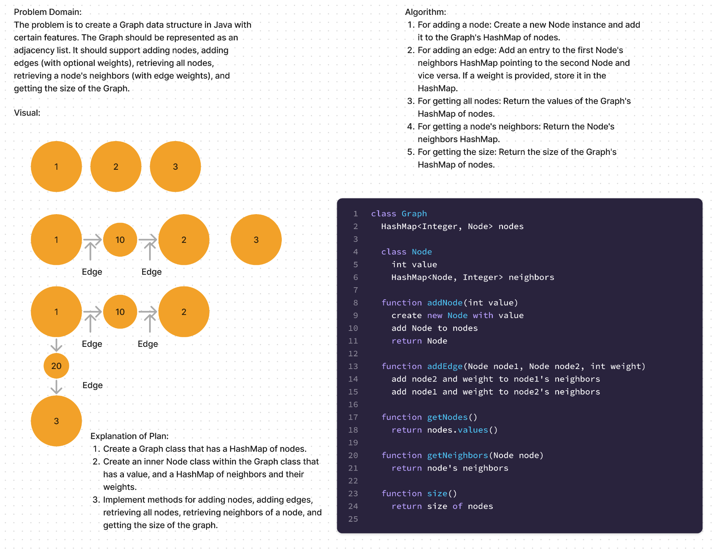

# Java Graph Implementation

This project is a simple Java implementation of a Graph data structure represented as an adjacency list.

## Features

The Graph supports the following operations:

- Adding nodes
- Adding edges (with optional weights)
- Retrieving all nodes
- Retrieving a node's neighbors (with edge weights)
- Getting the size of the Graph

## Implementation Details

- The Graph is represented by a HashMap of nodes.
- Each Node is represented by a value and a HashMap of its neighbors and corresponding edge weights.

### Whiteboard

### Methods

#### `public Node addNode(int value)`

Creates a new Node with the given value and adds it to the Graph.

#### `public void addEdge(Node node1, Node node2, int weight)`

Creates an edge between `node1` and `node2` with the specified weight.

#### `public void addEdge(Node node1, Node node2)`

Creates an edge between `node1` and `node2` with a default weight of 0.

#### `public Collection<Node> getNodes()`

Returns a Collection of all Nodes in the Graph.

#### `public HashMap<Node, Integer> getNeighbors(Node node)`

Returns a HashMap of the neighbors of the specified Node and the weights of the edges to those neighbors.

#### `public int size()`

Returns the total number of Nodes in the Graph.

## Testing

Unit tests for the Graph class are included. The tests use JUnit and cover all public methods of the Graph class.

## How to Run

1. Compile the Java files `GraphTest.java`.
2. Run the tests with `GraphTest`.

## Future Improvements

Currently, the Graph does not check for duplicate nodes or edges, and does not handle errors like trying to add an edge between nodes that do not exist. These cases could be handled in future updates.
