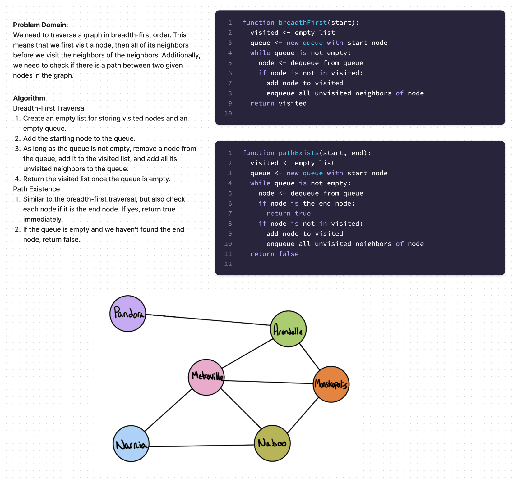

# Java Graph Implementation

This project is a simple Java implementation of a Graph data structure represented as an adjacency list.

## Features

The Graph supports the following operations:

- Adding nodes
- Adding edges
- Retrieving all nodes in breadth-first order
- Checking the existence of a path between two nodes

## Implementation Details

- The Graph is represented by a HashMap of nodes.
- Each Node is represented by a value and a List of its neighbors.

### Whiteboard

### Methods

#### `public Node addNode(String name)`

Creates a new Node with the given name and adds it to the Graph.

#### `public void addEdge(Node node1, Node node2)`

Creates an edge between `node1` and `node2`.

#### `public List<Node> breadthFirst(Node start)`

Performs a breadth-first search from the start Node and returns a list of nodes in the order they were visited.

#### `public boolean pathExists(Node start, Node end)`

Returns `true` if there is a path between the start Node and end Node, `false` otherwise.

## Testing

Unit tests for the Graph class are included. The tests use JUnit Jupiter and cover all public methods of the Graph class.

## How to Run

1. Compile the Java files `GraphTest.java`.
2. Run the tests with `GraphTest`.

## Future Improvements

Currently, the Graph does not check for duplicate nodes or edges, and does not handle errors like trying to add an edge between nodes that do not exist. These cases could be handled in future updates. Additionally, more complex graph operations could be implemented, such as finding the shortest path between two nodes.