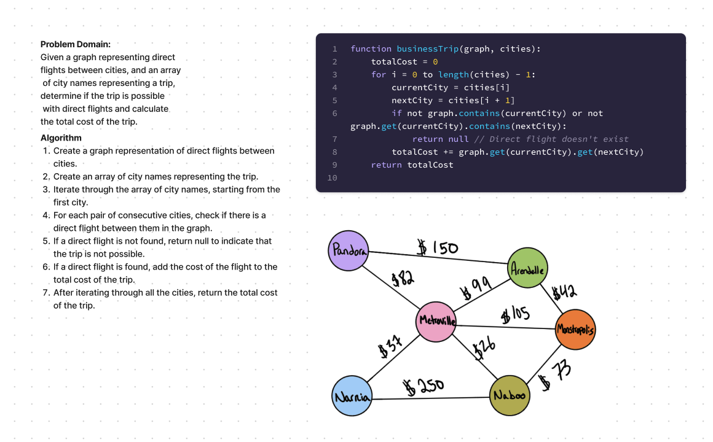

# Business Trip

The Business Trip program allows you to determine the cost of a trip between different cities. It checks if a direct flight is possible between the given cities and calculates the total cost of the trip.

## Features

The Business Trip program provides the following functionality:

- Calculating the cost of a trip between cities based on a graph representation of direct flights.
- Checking if a direct flight exists between each pair of consecutive cities in the trip.
- Returning the total cost of the trip if it is possible with direct flights.
- Returning `null` if a direct flight is not possible at any point in the trip.

## Implementation Details

The Business Trip program is implemented using Java. The core functionality is provided by the `BusinessTrip` class.

### `BusinessTrip` Class

The `BusinessTrip` class contains a static method:

#### `public static Integer businessTrip(Map<String, Map<String, Integer>> graph, String[] cities)`

This method takes a graph (represented as a `Map` of `String` to `Map` of `String` and `Integer`) and an array of city names as input. It checks if there is a direct flight between each pair of consecutive cities in the array and calculates the total cost of the trip. If a direct flight is not possible at any point, it returns `null`. Otherwise, it returns the total cost as an `Integer`.

### Whiteboard

## Testing

Unit tests for the Business Trip program are included in the `BusinessTripTest` class. The tests use JUnit Jupiter and cover different scenarios, such as a successful trip, an unsuccessful trip, and an empty graph. You can run the tests using your preferred testing framework.

## How to Run

To use the Business Trip program, follow these steps:

1. Create a `Map` object representing the graph of direct flights between cities. The keys of the outer map represent the source cities, and the inner map represents the destinations along with the associated cost of the flights.
2. Create an array of city names representing the trip you want to calculate the cost for.
3. Call the `BusinessTrip.businessTrip(graph, cities)` method, passing the graph and the array of city names as arguments. The method will return the total cost of the trip if it is possible with direct flights, or `null` if it is not possible.

## Future Improvements

Currently, the Business Trip program focuses on calculating the cost of a trip based on direct flights. In future updates, additional features could be implemented, such as finding the shortest path between two cities, handling graphs with weighted edges, or providing alternative routes if a direct flight is not available.

Contributions to the Business Trip program are always welcome! If you find any issues or have suggestions for improvement, please feel free to create a pull request.

